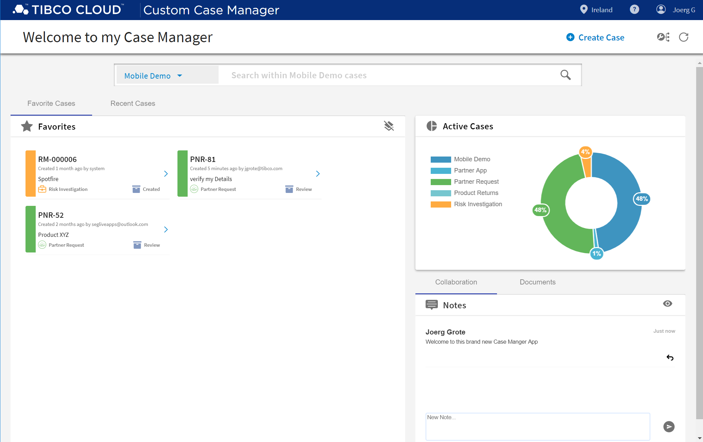

### TIBCO Cloud™ Starters Toolkit -- Base App
TCSTK Pattern - Base App, is an sample that just contains Core TIBCO Cloud Components.

**Base App**
The base pattern App, just contains everything from Authorisation and Navigation to standard Configure Options.
Ready to start you individual Solution from Scratch.

### Videos 
TBD ... a quick first video, to get an impression.

<iframe width="560" height="315" src="https://www.youtube.com/embed/x9qW8HhH-mM" frameborder="0" allow="accelerometer; autoplay; encrypted-media; gyroscope; picture-in-picture" allowfullscreen></iframe>

Link: [YouTube](https://youtu.be/x9qW8HhH-mM) ~2 min

### Help / How to 
#### Get Started 
some quicks way to get started

- [Getting Started](docs/tutorials/001-Getting-started.md)
- [Configure](docs/tutorials/002-Configure.md)

#### Configure 
how to configure the App

TBD

> All Configuration JSON Files can be found in "src/assets/config".

#### Basic Developer
dome basic Developer focused Details 

TBD

#### Advanced Developer
more advanced Details

TBD

# License
Copyright © 2019. TIBCO Software Inc.
This file is subject to the license terms contained
in the license file that is distributed with this file.

Please see tpc.txt for details of license and dependent third party components referenced by this library.
